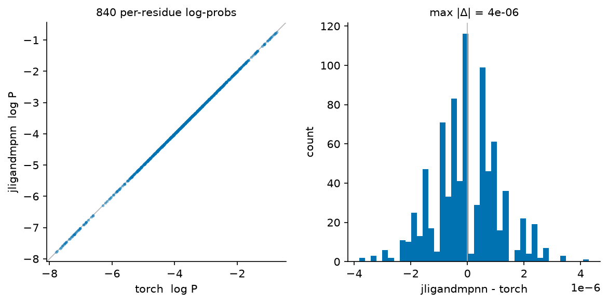

# jligandmpnn

[](https://github.com/ssiddhantsharma/jligandmpnn/actions/workflows/ci.yml)
[](LICENSE)

JAX/Equinox port of [LigandMPNN](https://github.com/dauparas/LigandMPNN) (Dauparas et al.).
Loads the released torch checkpoints via `from_torch` and adds a differentiable soft-sequence
path (`score_soft`), so the ligand-aware sequence log-likelihood is usable as an in-loop loss
for gradient-based design. Not affiliated with the authors.

## Install
```bash
pip install -e .        # jax + equinox
```
Weight conversion uses the PyTorch reference vendored under `reference/` (see `NOTICE`).

## Usage
```python
from jligandmpnn.model import LigandMPNN
model = LigandMPNN.from_torch(torch_ligand_mpnn)     # a loaded ligandmpnn_v_32_* checkpoint
log_probs = model.score_soft(soft20, X, mask, Y, Y_m, Y_t, R_idx, chain_labels, chain_mask, randn)
```
`score` teacher-forces an integer sequence; `score_soft` takes a soft `[.., 20]` sequence
(native LigandMPNN order) so gradients flow to it. Scope: `model_type="ligand_mpnn"`,
`use_side_chains=False`. Runnable example: [`examples/score.py`](examples/score.py).

## Parity


*Reproduces the torch reference to floating-point precision (max |Δ| 4e-6 on the score
log-probs), verified in CI against the real `ligandmpnn_v_32_010_25` checkpoint. `pytest tests`.*
